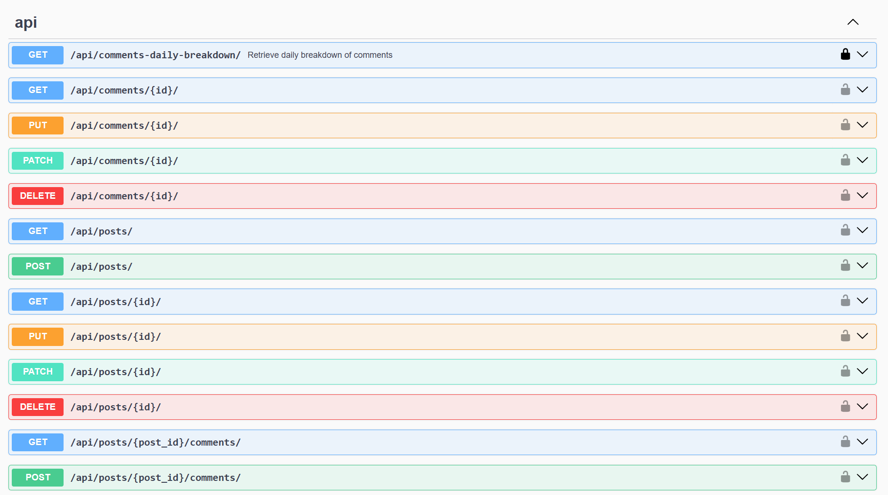

# API for Post and Comment Management:

A Django-based web application designed to manage posts and comments with AI moderation and automated responses. Key features include:

- User Registration and Authentication: Allows users to register and log in using JWT for secure access.
- Management API: Full CRUD operations for managing posts/comments.
- Content Moderation: Checks for inappropriate language or offensive content in posts and comments during creation, blocking any flagged submissions.
- Comment Analytics: Provides analytics on the number of comments added to posts over a specified period.
- Automated Responses: Enables users to set up automated replies to coqmments on their posts, with a customizable delay and relevance to the original post and comment.
- Test Coverage: Includes unit tests for post creation and analytics functionalities.

## Installation
#### Docker 
```
git clone https://github.com/haldaniko/Starnavi-TestTask.git`
cd Starnavi-TestTask

(Copy .env.sample to .env and populate it with all required data)

docker-compose build
docker-compose up
```
#### Manual
```
git clone `https://github.com/haldaniko/Starnavi-TestTask.git`
cd Starnavi-TestTask

# on macOS
python3 -m venv venv
source venv/bin/activate

# on Windows
python -m venv venv
venv\Scripts\activate

pip install -r requirements.txt

(Copy .env.sample to .env and populate it with all required data.)

python manage.py migrate
python manage.py loaddata fixture.json
python manage.py runserver
python manage.py test
```

The API will be available at `http://127.0.0.1:8000/`

## Demo

